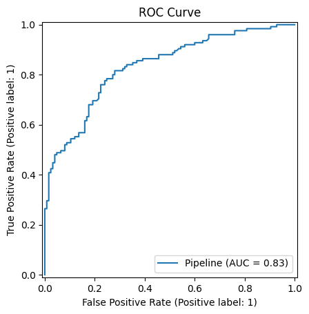
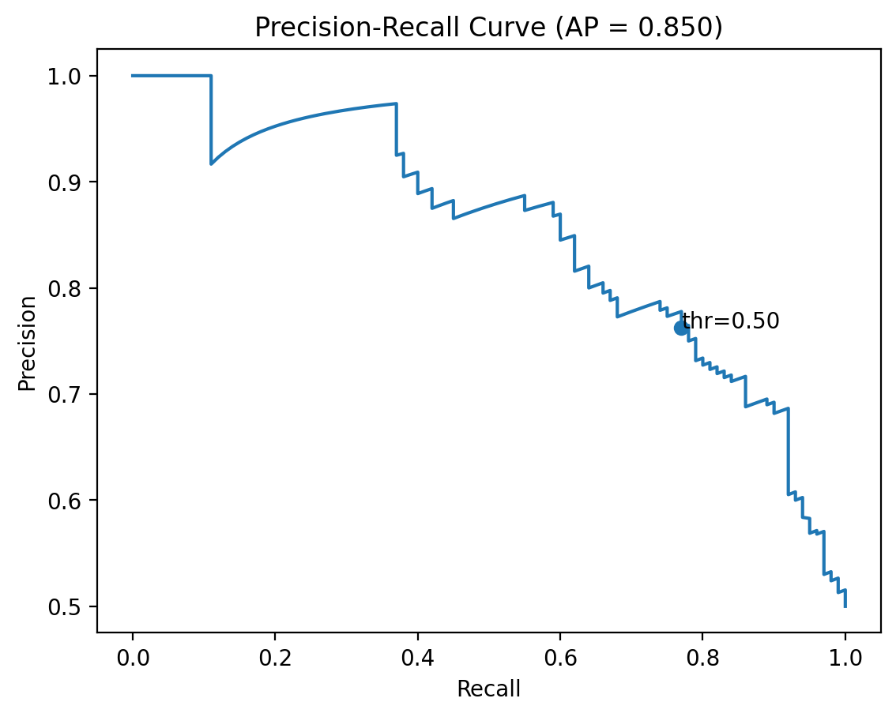

# Credit Amount Prediction

This project predicts whether a credit amount is considered **High** or **Low** based on customer features, using machine learning.  

## 📂 Project Structure
```
credit_project/
│── app/                 # Streamlit app
│   └── app.py           # Main application script
│── models/              # Trained models (if applicable)
│── notebooks/           # Jupyter notebooks for EDA & experiments
│── requirements.txt     # Dependencies
│── README.md            # Project documentation
```

## 🚀 How to Run

1. Clone the repository:
   ```bash
   git clone https://github.com/your-username/credit_project.git
   cd credit_project/app
   ```

2. Create a virtual environment and activate it:
   ```bash
   python -m venv .venv
   .venv\Scripts\activate   # Windows
   source .venv/bin/activate # Mac/Linux
   ```

3. Install dependencies:
   ```bash
   pip install -r requirements.txt
   ```

4. Run the Streamlit app:
   ```bash
   streamlit run app.py
   ```

---

## 📊 Model Performance

- **Accuracy:** 0.75  
- **F1-score:** 0.73  
- **ROC-AUC:** 0.83  
- **Train size:** 750  
- **Test size:** 250  
- **Target Definition:** `HighAmount = (Credit amount > median 2319.5)`

---

## 📈 Evaluation Results

### ROC Curve


### Confusion Matrix (Threshold = 0.5)


### Precision-Recall Curve


---

## 🔧 Tech Stack
- **Python 3.11+**
- **Streamlit** – Interactive web application  
- **Scikit-learn** – Machine learning models  
- **Matplotlib/Seaborn** – Visualization  
- **Pandas/Numpy** – Data processing  

---

## 📌 Next Steps
- Hyperparameter tuning (GridSearch / RandomizedSearch).  
- Feature engineering for better accuracy.  
- Deployment to cloud (Streamlit Cloud / Heroku / AWS).  
- Add Docker support.  
