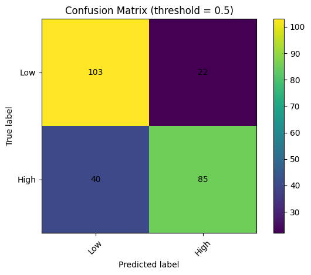
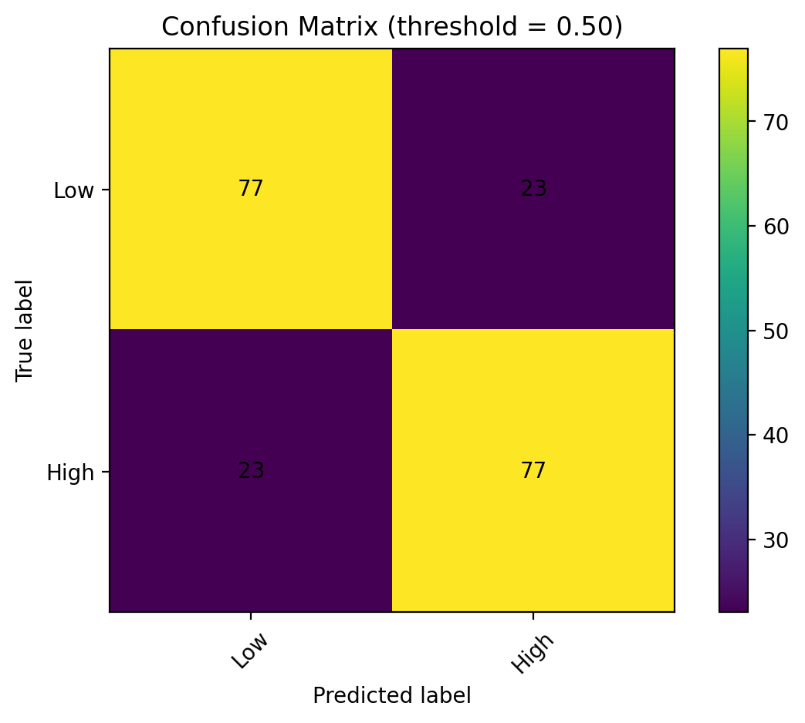

# German Credit Predictor

A machine learning project for predicting whether a credit amount is
considered **High** or **Low**, based on customer and financial
attributes.\
The app is built with **Streamlit**, and the model is trained and
evaluated using scikit-learn.

------------------------------------------------------------------------

## Features

-   Data preprocessing and feature engineering.
-   Training and evaluation of ML models.
-   Metrics: Accuracy, F1-score, ROC-AUC.
-   Visualization of model performance:
    -   ROC Curve
    -   Confusion Matrix
    -   Precision-Recall Curve
-   Streamlit app for interactive predictions.

------------------------------------------------------------------------

## Installation

Clone the repository:

``` bash
git clone https://github.com/lironshpiegel03/german_credit_predictor.git
cd german_credit_predictor
```

Create a virtual environment:

``` bash
python -m venv .venv
.venv\Scripts\activate   # On Windows
```

Install dependencies:

``` bash
pip install -r requirements.txt
```

Run the Streamlit app:

``` bash
streamlit run app/app.py
```

------------------------------------------------------------------------

## Model Evaluation

### ROC Curve


### Confusion Matrix (Full Test Set)



### Confusion Matrix (Balanced Subset)



### Precision-Recall Curve


------------------------------------------------------------------------

## Streamlit App


------------------------------------------------------------------------

## Project Structure

    credit_project/
    │── app/
    │   └── app.py
    │── src/
    │   └── train.py
    │── requirements.txt
    │── README.md
    │── images/
    │   ├── roc_curve.png
    │   ├── confusion_matrix1.png
    │   ├── confusion_matrix2.png
    │   ├── precision_recall.png
    │   └── app_screenshot.png

------------------------------------------------------------------------

## Results

-   **Accuracy**: \~0.75\
-   **F1 Score**: \~0.73\
-   **ROC-AUC**: \~0.83

------------------------------------------------------------------------

## License

This project is licensed under the MIT License.
